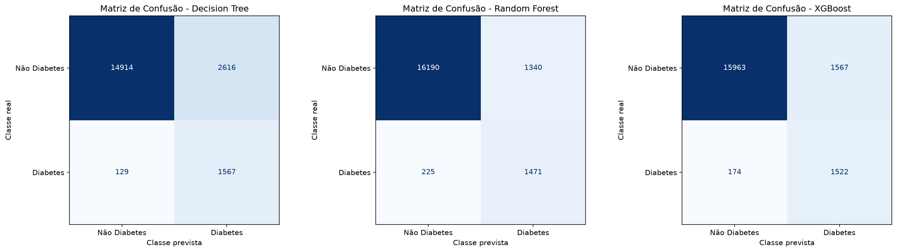
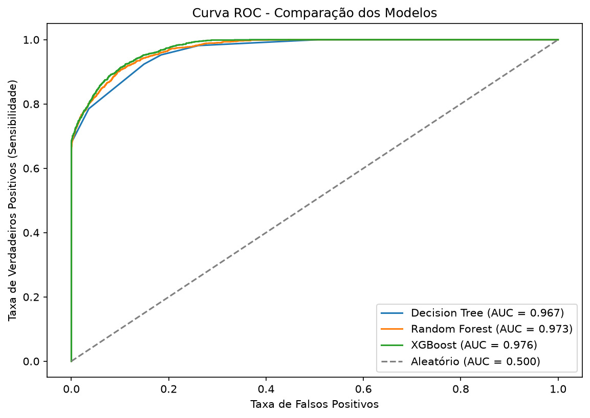
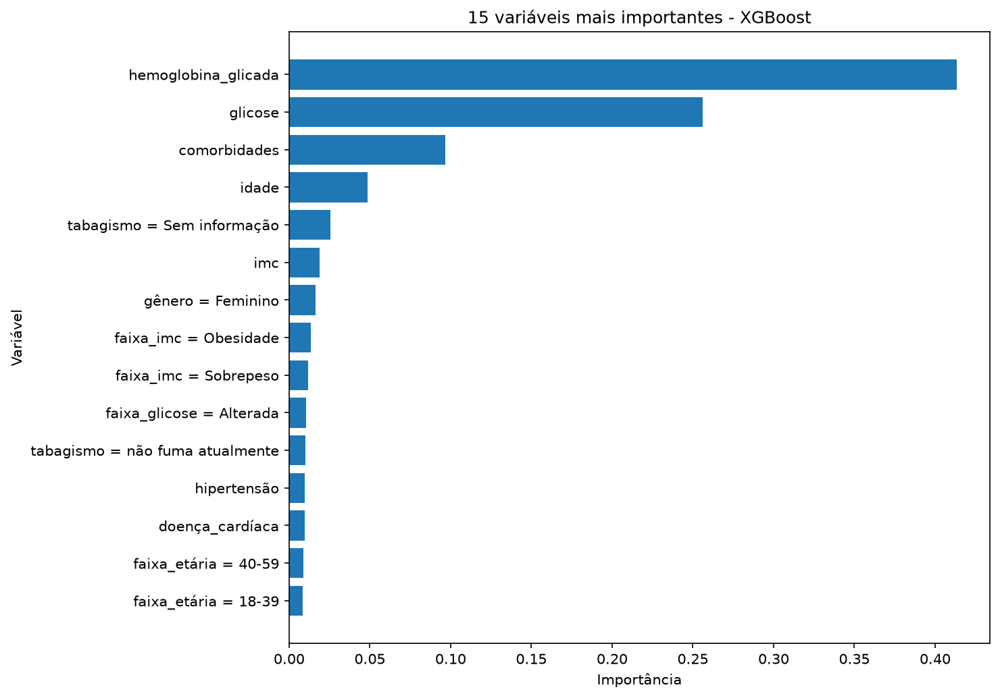

# Modelo Preditivo para Identificação Precoce do Risco de Diabetes

Projeto da disciplina **Data Mining and Predictive Analytics** (UniFECAF).

## Objetivo do projeto

Uma rede nacional de clínicas quer identificar automaticamente os pacientes com maior probabilidade de ter diabetes. O objetivo é priorizar exames, orientações e programas de acompanhamento preventivo, uma triagem que hoje é feita de forma manual.

O projeto constrói e compara três modelos de classificação supervisionada (Decision Tree, Random Forest e XGBoost) e recomenda o mais adequado para uso real. A metodologia seguida é a **CRISP-DM**.

## Base de dados

**Diabetes Prediction Dataset** (Kaggle): <https://www.kaggle.com/datasets/iammustafatz/diabetes-prediction-dataset>

A base tem 100.000 pacientes e 9 colunas:

| Variável | Descrição |
|---|---|
| `gender` | Gênero (Female, Male, Other) |
| `age` | Idade (anos) |
| `hypertension` | Hipertensão (0 = não, 1 = sim) |
| `heart_disease` | Doença cardíaca (0 = não, 1 = sim) |
| `smoking_history` | Histórico de tabagismo (never, former, current, not current, ever, No Info) |
| `bmi` | Índice de massa corporal (IMC) |
| `HbA1c_level` | Hemoglobina glicada (%) |
| `blood_glucose_level` | Glicose no sangue (mg/dL) |
| `diabetes` | **Variável alvo** (0 = não, 1 = sim) |

Problemas identificados na base:
- 3.854 registros duplicados, que foram removidos.
- 18 registros com gênero "Other", que foram removidos por serem insuficientes para o aprendizado.
- 35,8% dos registros têm `smoking_history = "No Info"`, um valor ausente disfarçado. Essa categoria foi mantida como uma categoria própria.
- A classe alvo é desbalanceada: apenas 8,5% dos pacientes têm diabetes.
- Há valores extremos clinicamente possíveis, como IMC de até ~96 e bebês com 0,08 ano. Eles foram mantidos.

## Bibliotecas utilizadas

- **pandas** e **numpy**: manipulação dos dados
- **matplotlib**: visualizações
- **scikit-learn**: pipeline de pré-processamento, Decision Tree, Random Forest, métricas e validação cruzada
- **xgboost**: modelo XGBoost
- **joblib**: salvamento do modelo final

Para instalar:

```
pip install pandas numpy matplotlib scikit-learn xgboost joblib
```

## Como executar

1. Deixe o arquivo `diabetes_prediction_dataset.csv` (incluído no projeto ou baixado do Kaggle) na mesma pasta do `projeto_diabetes.py`.
2. Execute `python projeto_diabetes.py`. No Google Colab ou no Jupyter, cole o código em uma célula e execute. No Colab, será aberta uma janela para enviar o CSV.
3. Os gráficos são salvos na pasta `graficos/`, e o modelo final é salvo em `modelo_diabetes.pkl`.

## Etapas desenvolvidas (CRISP-DM)

1. **Entendimento do negócio:** definição do problema e do critério de sucesso. Na triagem, um falso negativo (diabético não identificado) é mais grave do que um falso positivo, por isso o Recall recebe atenção especial.
2. **Entendimento dos dados:** análise das dimensões, tipos, estatísticas, valores ausentes, duplicados e distribuição do alvo. Também foram analisadas a taxa de diabetes por categoria, os histogramas, os boxplots por classe e a matriz de correlação.
3. **Preparação dos dados:**
   - Limpeza, com remoção de duplicados e da categoria "Other".
   - **Atributos derivados** baseados em critérios clínicos: faixa de IMC (OMS), faixa de HbA1c (ADA), faixa de glicose, faixa etária e número de comorbidades (hipertensão + doença cardíaca).
   - Separação estratificada entre treino (80%) e teste (20%).
   - `Pipeline` com `ColumnTransformer`: `StandardScaler` nas variáveis numéricas e `OneHotEncoder` nas categóricas. O pré-processamento é ajustado apenas no treino, o que evita vazamento de dados.
4. **Modelagem:** Decision Tree (`max_depth=6`), Random Forest (200 árvores) e XGBoost (300 árvores). O desbalanceamento foi tratado com `class_weight="balanced"` na Decision Tree e no Random Forest, e com `scale_pos_weight` no XGBoost.
5. **Avaliação:** matriz de confusão, Accuracy, Precision, Recall, F1-Score, curva ROC e AUC. Também foram feitas uma validação cruzada estratificada com 5 folds e uma análise do limiar de decisão.
6. **Implantação:** o pipeline completo é salvo com joblib. O script inclui um exemplo de aplicação em novos pacientes.

## Comparação dos modelos

Resultados no conjunto de teste (19.226 pacientes, limiar 0,5):

| Modelo | Accuracy | Precision | Recall | F1-Score | AUC | AUC (validação cruzada) |
|---|---|---|---|---|---|---|
| **XGBoost** | 0,909 | 0,493 | 0,897 | 0,636 | **0,976** | **0,978 ± 0,001** |
| Random Forest | 0,919 | 0,523 | 0,867 | 0,653 | 0,973 | 0,976 ± 0,001 |
| Decision Tree | 0,857 | 0,375 | 0,924 | 0,533 | 0,967 | 0,967 ± 0,001 |

Efeito do limiar de decisão no XGBoost:

| Limiar | Recall | Precision | Diabéticos não identificados (FN) | Falsos positivos |
|---|---|---|---|---|
| 0,3 | 0,951 | 0,384 | 83 | 2.583 |
| 0,5 | 0,897 | 0,493 | 174 | 1.567 |
| 0,7 | 0,810 | 0,666 | 322 | 688 |

Variáveis mais importantes do XGBoost:
1. HbA1c_level (41%)
2. blood_glucose_level (26%)
3. comorbidades, o atributo derivado (10%)
4. smoking_history (6%)
5. idade (5%)

## Conclusão final

O modelo recomendado é o **XGBoost**. Ele obteve a maior AUC tanto no teste (0,976) quanto na validação cruzada (0,978 ± 0,001), o que mostra que ele separa melhor pacientes com e sem diabetes e que esse resultado é estável. A Decision Tree tem Recall alto, mas gera muitos falsos positivos. O Random Forest fica próximo, mas tem AUC e Recall menores. A Accuracy não foi usada como critério porque, com 91,5% de não diabéticos, ela é enganosa.

Recomendamos usar o modelo com **limiar de 0,3**. Com ele, o Recall chega a 0,951 e os diabéticos não identificados caem de 174 para 83. O custo são mais exames confirmatórios, algo aceitável em um programa preventivo.

Os fatores mais influentes foram HbA1c e glicose, que são clinicamente coerentes por serem os próprios critérios diagnósticos. Em seguida vêm o número de comorbidades, a idade e o IMC. O modelo é especialmente útil para encontrar casos ainda não diagnosticados. Antes do uso em produção, ele deve ser validado com dados reais da rede de clínicas, e o ideal seria complementá-lo com histórico familiar e dados longitudinais.

## Gráficos






